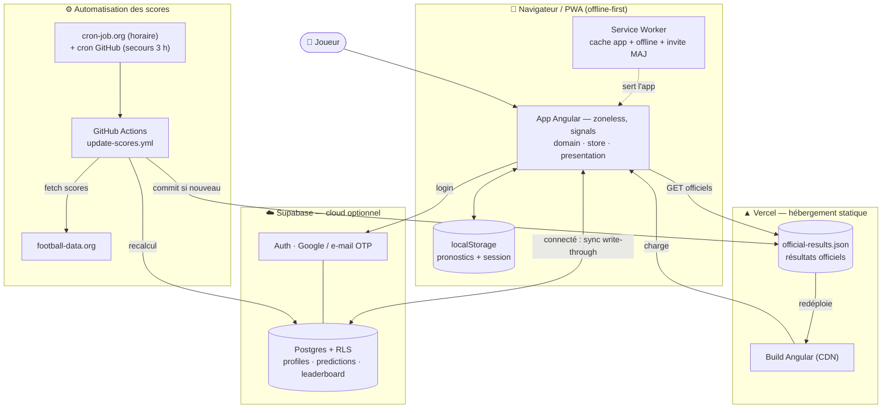
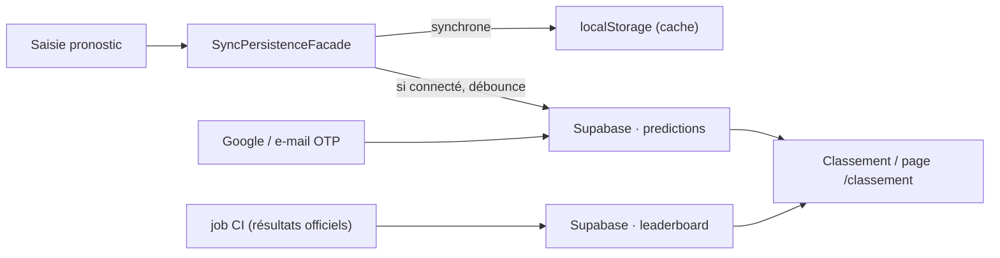
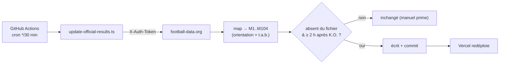

# Pronoscup 2026


-3ECF8E?logo=supabase&logoColor=white)


Application de pronostics pour la Coupe du Monde FIFA 2026 (48 équipes, 12 groupes,
104 matchs) : saisie des scores, classements et qualification automatiques (2 premiers
+ 8 meilleurs 3es), tableau final à 32 avec propagation des vainqueurs, comparaison des
pronostics aux résultats officiels. Application **statique, hors-ligne (PWA)** ; **backend cloud
optionnel** (Supabase) pour la sauvegarde par compte, l'authentification (Google ou e-mail) et le
classement entre joueurs — l'app reste **100 % fonctionnelle en local** si le cloud n'est pas configuré.

## Vue d'ensemble du fonctionnement



**En clair :** le joueur charge l'app (servie en statique par Vercel, utilisable **hors-ligne** via le
service worker). Ses pronostics vont d'abord en **localStorage** ; s'il **se connecte** (Google ou
e-mail OTP), ils sont **synchronisés** dans Supabase (write-through) et il entre au **classement**.
En parallèle, **cron-job.org** déclenche **GitHub Actions** qui récupère les **scores officiels**,
met à jour `official-results.json` (→ Vercel redéploie) et **recalcule le classement** dans Supabase.

## Architecture (SOLID, hexagonale)

```
src/app/
  domain/          # TypeScript pur (0 dépendance Angular) : modèles, données,
                   # moteurs (poules, KO, 3es par backtracking), policies, validation,
                   # ports (persistence, official-results, file-io, auth, remote-predictions, profile, sync-prompts)
  application/     # TournamentStore (signals + computed + garde de verrouillage),
                   # AccountSyncService (import/sync de compte), PwaUpdateService (maj PWA)
  infrastructure/  # adapters : LocalStorage, résultats officiels, I/O fichier,
                   # facade write-through (cache local + push cloud), adaptateurs Supabase (auth/predictions/profile)
  presentation/    # Angular Material + routeur : accueil (poules/3es/tableau), page /classement, login e-mail
```

- **Signals** (zoneless, OnPush) : 2 sources de vérité (pronostics + officiels) → tout le reste `computed`.
- **Cloud optionnel** : nouveaux ports + adaptateurs Supabase (voir [Cloud optionnel (Supabase)](#cloud-optionnel-supabase)).
  Si l'environnement Supabase n'est pas renseigné, ces adaptateurs sont inertes → mode local pur.
- **Résultats officiels** = fichier serveur `public/official-results.json`, alimenté
  **automatiquement** (API football-data.org via GitHub Actions, voir plus bas) **ou à la main**
  (la saisie manuelle prime). Tout match ayant un résultat officiel — ou dont le coup d'envoi
  est passé — est **en lecture seule** (garde dans le store + `disabled` UI) ; l'officiel pilote
  classements et bracket, le pronostic reste affiché en comparaison (✓ exact / ≈ bon résultat / ✗ raté).
- **PWA offline** : service worker, polices auto-hébergées, `official-results.json` en cache *freshness*.

## Démarrage

```bash
npm install
npm start            # http://localhost:4200
```

## Tests

```bash
npm test             # tests unitaires de l'app (Vitest) — 118
npm run test:scripts # tests des scripts (updater + classement, Vitest env node) — 18
npm run e2e          # tests end-to-end (Playwright) — 3
```

## Build de production (PWA)

```bash
npm run build        # sortie : dist/wcng2026/browser
```

> Le service worker n'est actif qu'en build de production. Pour tester l'offline,
> servez `dist/wcng2026/browser` (ex. `npx http-server dist/wcng2026/browser`).

## Cloud optionnel (Supabase)

Par défaut, les pronostics sont stockés en **localStorage** (anonyme, par appareil) — l'app marche
hors-ligne sans compte. **Se connecter** active la **sauvegarde par compte**, la **synchro
multi-appareils** et le **classement entre joueurs**. Tant que l'environnement Supabase n'est pas
renseigné, tout le volet cloud est **désactivé** (mode local pur).

### Authentification

- **Google** (OAuth) et **e-mail (code OTP, sans mot de passe)** — l'e-mail est idéal iOS/PWA (aucune
  redirection). Le mode **anonyme** reste disponible (saisie locale sans compte).
- L'**unicité du compte** est garantie par l'e-mail (`auth.users`, géré par Supabase).
- À la première connexion : choix d'un **pseudo** (public, affiché au classement), puis **import**
  des pronostics locaux / **résolution de conflit** si les deux côtés diffèrent.

### Synchronisation (write-through)

`SyncPersistenceFacade` écrit le **cache localStorage immédiatement** (offline) puis **pousse vers le
cloud en différé** (débounce ~1,5 s) si connecté ; en cas d'échec réseau, re-tentative à la reconnexion.
Supabase (`@supabase/supabase-js`) est chargé **paresseusement** et **uniquement** si une session existe
ou au retour OAuth → un visiteur anonyme ne le télécharge jamais.



### Schéma de la base ([`supabase/migrations/0001_init.sql`](supabase/migrations/0001_init.sql))

| Table | Contenu | RLS |
|-------|---------|-----|
| `profiles` | `user_id`, `pseudo` (unique), `created_at` | lecture **publique** (pseudos), écriture self |
| `predictions` | `user_id`, `scores` (jsonb), `version`, `updated_at` | **privé** : chacun ne lit/écrit que sa ligne |
| `leaderboard` | `user_id`, `pseudo`, `points`, `exact`, `outcome`, `updated_at` | lecture publique ; écriture réservée au job (service_role) |

Les **pronostics restent privés** (RLS own-row) ; le classement n'expose que `pseudo` + points.
Le `user_id` ↔ e-mail vit dans `auth.users` (visible seulement dans la console Supabase / SQL Editor,
jamais depuis l'app).

### Classement (calculé côté CI)

Le score d'un joueur ne change qu'au changement des résultats officiels. Le script
[`scripts/update-leaderboard.ts`](scripts/update-leaderboard.ts) (lancé après l'updater de scores)
lit tous les `predictions` + `profiles` (clé `service_role`), recalcule via `TournamentEngine`
(barème : 3 pts/score exact, 1 pt/bon résultat) et **upsert** la table `leaderboard`.

### Activer le cloud

1. Créer un projet **Supabase** (free) et exécuter `supabase/migrations/0001_init.sql` (SQL Editor).
2. **Authentication → Providers** : activer **Google** (client OAuth Google Cloud) et/ou **Email** (OTP).
   **URL Configuration → Redirect URLs** : `http://localhost:4200` + le domaine Vercel.
3. Renseigner l'URL + la **clé anon** (publiques) dans [`src/environments/environment.ts`](src/environments/environment.ts) :

   ```ts
   supabase: { url: 'https://<ref>.supabase.co', anonKey: 'sb_publishable_…' }
   ```

> ⚠️ La clé **`service_role`** (secrète) ne va **jamais** dans le code — uniquement dans les secrets
> GitHub pour le job de classement (voir ci-dessous).

## Mettre à jour les résultats officiels

Deux voies alimentent `public/official-results.json` — **la saisie manuelle prime**.

### Automatique (GitHub Actions)

Le workflow [`.github/workflows/update-scores.yml`](.github/workflows/update-scores.yml) tourne
toutes les ~30 min : il interroge l'API [football-data.org](https://www.football-data.org/)
(Coupe du Monde), mappe chaque match terminé sur nos ids `M1..M104` (orientation + tirs au but,
via `TournamentEngine`), valide, et **commit** le fichier si un score est tombé → Vercel redéploie.
Un match n'est relevé qu'**à partir de 2 h après son coup d'envoi** ; sinon le tick suivant réessaie.



Après l'écriture des scores, le workflow lance aussi l'**étape classement**
([`scripts/update-leaderboard.ts`](scripts/update-leaderboard.ts)) qui recalcule la table
`leaderboard` Supabase (no-op si les secrets Supabase sont absents).

- **Secrets** (*Settings → Secrets → Actions*) :
  - `FOOTBALL_DATA_TOKEN` — jeton lecture seule de l'API de scores.
  - `SUPABASE_URL` + `SUPABASE_SERVICE_ROLE_KEY` — pour l'étape classement (clé **secrète**, ici uniquement).
- **Manuel / test** : *Actions → Update official scores → Run workflow* (ou `npm run update:scores` /
  `npm run update:leaderboard`, options `… -- --dry-run`).
- ⚠️ Vérifier que la **CDM 2026** est couverte par l'**offre gratuite** de l'API (sinon, changer de
  source — même script).

#### Fiabilité du déclenchement (cron-job.org)

Le cron interne de GitHub Actions est **souvent retardé/sauté** (file d'attente partagée, surtout en
haute fréquence). Pour un déclenchement **ponctuel**, un planificateur externe gratuit
([cron-job.org](https://cron-job.org)) appelle l'API `workflow_dispatch` :

```
POST https://api.github.com/repos/bencrob/wc2026/actions/workflows/update-scores.yml/dispatches
Headers: Authorization: Bearer <PAT fine-grained, scope Actions:write>
         Accept: application/vnd.github+json · X-GitHub-Api-Version: 2022-11-28
Body:    {"ref":"main"}        # réponse attendue : 204
```

Le cron natif GitHub peut être conservé comme **filet de secours** (idéalement passé en basse fréquence).
L'updater étant **idempotent** (+ `concurrency`), un double déclenchement est sans risque.
(Cron Vercel non utilisé : free tier = 1/jour.)

### Manuelle (correction / fallback)

Éditer `public/official-results.json` puis `git push` (Vercel redéploie). Une valeur saisie à la
main n'est **jamais écrasée** par l'auto.

```json
{
  "version": 1,
  "results": {
    "M73": { "home": 1, "away": 1, "winner": "home" }
  }
}
```

Les matchs concernés passent en lecture seule au prochain chargement.
