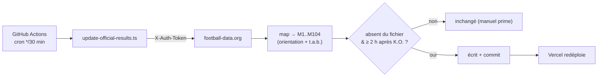

# Pronoscup 2026


Application de pronostics pour la Coupe du Monde FIFA 2026 (48 équipes, 12 groupes,
104 matchs) : saisie des scores, classements et qualification automatiques (2 premiers
+ 8 meilleurs 3es), tableau final à 32 avec propagation des vainqueurs, comparaison des
pronostics aux résultats officiels. Application **statique, hors-ligne (PWA)**, sans backend.

## Architecture (SOLID, hexagonale)

```
src/app/
  domain/          # TypeScript pur (0 dépendance Angular) : modèles, données,
                   # moteurs (poules, KO, 3es par backtracking), policies, validation, ports
  application/     # TournamentStore : signals + computed (état dérivé) + garde de verrouillage
  infrastructure/  # adapters : LocalStorage, résultats officiels serveur, I/O fichier
  presentation/    # Angular Material (poules, 3es, tableau final, composants UI)
```

- **Signals** (zoneless, OnPush) : 2 sources de vérité (pronostics + officiels) → tout le reste `computed`.
- **Résultats officiels** = fichier serveur `public/official-results.json`, alimenté
  **automatiquement** (API football-data.org via GitHub Actions, voir plus bas) **ou à la main**
  (la saisie manuelle prime). Tout match ayant un résultat officiel — ou dont le coup d'envoi
  est passé — est **en lecture seule** (garde dans le store + `disabled` UI) ; l'officiel pilote
  classements et bracket, le pronostic reste affiché en comparaison (✓ exact / ≈ bon résultat / ✗ raté).
- **PWA offline** : service worker, polices auto-hébergées, `official-results.json` en cache *freshness*.

## Démarrage

```bash
npm install
npm start            # http://localhost:4200
```

## Tests

```bash
npm test             # tests unitaires de l'app (Vitest) — 99
npm run test:scripts # tests de l'updater de scores (Vitest, env node) — 13
npm run e2e          # tests end-to-end (Playwright) — 3
```

## Build de production (PWA)

```bash
npm run build        # sortie : dist/wcng2026/browser
```

> Le service worker n'est actif qu'en build de production. Pour tester l'offline,
> servez `dist/wcng2026/browser` (ex. `npx http-server dist/wcng2026/browser`).

## Mettre à jour les résultats officiels

Deux voies alimentent `public/official-results.json` — **la saisie manuelle prime**.

### Automatique (GitHub Actions)

Le workflow [`.github/workflows/update-scores.yml`](.github/workflows/update-scores.yml) tourne
toutes les ~30 min : il interroge l'API [football-data.org](https://www.football-data.org/)
(Coupe du Monde), mappe chaque match terminé sur nos ids `M1..M104` (orientation + tirs au but,
via `TournamentEngine`), valide, et **commit** le fichier si un score est tombé → Vercel redéploie.
Un match n'est relevé qu'**à partir de 2 h après son coup d'envoi** ; sinon le tick suivant réessaie.



- **Secret** : `FOOTBALL_DATA_TOKEN` (jeton lecture seule) dans *Settings → Secrets → Actions*.
- **Manuel / test** : *Actions → Update official scores → Run workflow* (ou `npm run update:scores`,
  options `FOOTBALL_DATA_TOKEN=… NOW=<ISO> … -- --dry-run`).
- ⚠️ Vérifier que la **CDM 2026** est couverte par l'**offre gratuite** de l'API (sinon, changer de
  source — même script). Cron Vercel non utilisé : le **free tier Vercel = 1 cron/jour**, insuffisant.

### Manuelle (correction / fallback)

Éditer `public/official-results.json` puis `git push` (Vercel redéploie). Une valeur saisie à la
main n'est **jamais écrasée** par l'auto.

```json
{
  "version": 1,
  "results": {
    "M73": { "home": 1, "away": 1, "winner": "home" }
  }
}
```

Les matchs concernés passent en lecture seule au prochain chargement.
