# Déploiement

Hébergement **Vercel** (statique + CDN, aucun backend). Repo `bencrob/wc2026`.

## Configuration
- `vercel.json` : `framework: angular`, `buildCommand: npm run build`, `outputDirectory: dist/wcng2026/browser`.
- ⚠️ L'**output dir** doit pointer sur `.../browser` (sortie du builder `@angular/build:application`), sinon page blanche.

## Cycle de déploiement
- **`git push` sur `main` → Vercel redéploie automatiquement.** Pas de commande manuelle.
- Redéploiement sans changement : dashboard Vercel → *Deployments* → *Redeploy*.

## Mettre à jour les résultats officiels
Cf. [[Règles métier#Résultats officiels & verrouillage]]. Deux voies, **la saisie manuelle prime**.

### A. Automatique (GitHub Actions)
Le workflow [`.github/workflows/update-scores.yml`](../.github/workflows/update-scores.yml) tourne **toutes les ~30 min** : il interroge l'API [football-data.org](https://www.football-data.org/) (compétition Coupe du Monde), mappe chaque match terminé sur nos ids internes, et **commit** `public/official-results.json` si un nouveau score est tombé → Vercel redéploie. Un match n'est relevé qu'**à partir de 2 h après son coup d'envoi** ; s'il n'est pas encore final, le tick suivant réessaie (≈30 min plus tard, etc.).

```mermaid
flowchart LR
  CRON["GitHub Actions<br/>cron */30 min"] --> SCRIPT["scripts/update-official-results.ts"]
  SCRIPT -->|"X-Auth-Token"| API["football-data.org<br/>matchs terminés"]
  API --> MAP["map → ids M1..M104<br/>(orientation + t.a.b.)<br/>via TournamentEngine"]
  MAP --> MERGE{"match absent<br/>du fichier ?"}
  MERGE -->|non : saisie manuelle| SKIP["on ne touche pas"]
  MERGE -->|oui & ≥ 2 h après coup d'envoi| VALID["valide (ScoreMapValidator)"]
  VALID --> WRITE["écrit public/official-results.json"]
  WRITE --> COMMIT["git commit + push"]
  COMMIT --> VERCEL["Vercel redéploie"]
  VERCEL --> APP["app : match verrouillé + comparaison + score"]
```



- **Secret requis** : `FOOTBALL_DATA_TOKEN` (jeton lecture seule) dans *Repo → Settings → Secrets → Actions*.
- **Déclenchement manuel** : onglet *Actions → Update official scores → Run workflow* (option `now` pour simuler une date).
- ⚠️ **Pré-requis à vérifier** : que la **CDM 2026** soit couverte par l'offre **gratuite** de l'API. Sinon, basculer de source (même structure de script). Le script no-op proprement si la donnée est absente.
- ⚠️ Pourquoi pas un **cron Vercel** ? Le plan **gratuit Vercel = 1 cron/jour max** → insuffisant pour le rythme « +2 h / réessais ». GitHub Actions (gratuit, flexible) commit le fichier → Vercel redéploie sur push.

### B. Manuelle (prioritaire, fallback / correction)
1. Éditer `public/official-results.json` (ajouter/corriger les scores ; `winner` obligatoire sur un KO nul).
2. `git commit` + `git push`.
3. Vercel redéploie → au prochain chargement, les matchs concernés passent **verrouillés** + comparaison affichée.

Une valeur saisie à la main n'est **jamais écrasée** par l'auto (l'updater ne remplit que les matchs absents du fichier).

Format :
```json
{ "version": 1, "results": { "M1": { "home": 3, "away": 1 },
                             "M73": { "home": 1, "away": 1, "winner": "home" } } }
```

## PWA / hors-ligne
- Service worker (`ngsw-config.json`) actif **en prod uniquement**. Cache : app-shell + JS/CSS + **polices auto-hébergées** ; `official-results.json` en stratégie **freshness** (réseau d'abord, repli cache → verrouillage maintenu hors-ligne).
- Installable (manifest « Pronoscup 2026 »).

## SEO
- `public/robots.txt` + `public/sitemap.xml` + `<meta name="description">` (corrige l'erreur SPA « robots.txt invalide »).

## Conventions Git
- Auteur : `bencrob <benjapi@free.fr>`. **Jamais** de mention Claude/Anthropic dans les commits.
